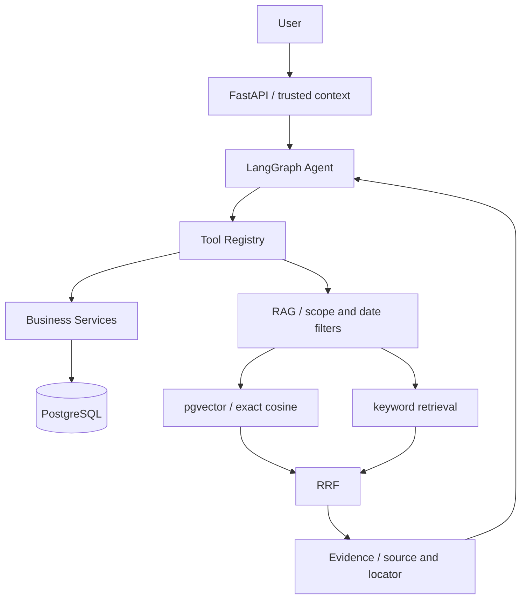
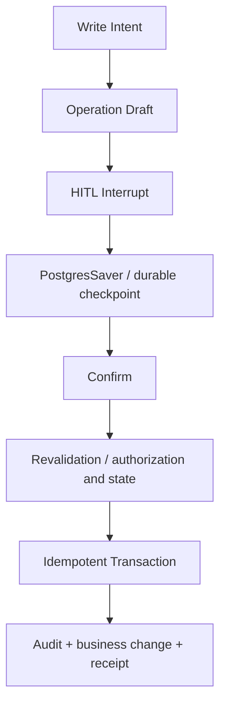

# Ecommerce Ops Agent

**Stable Preview · Phase 07 offline completed · Phase 08 not started**

基于 FastAPI、LangGraph 和 PostgreSQL 的电商运营 Agent。把商品、库存、订单、物流查询与售后规则检索串成可追溯流程，并对取消订单、退款申请加入人工确认和事务保护。模型提出动作，服务端负责授权、业务规则和实际执行。

仓库内的 Seed、Fixture（测试样例）和 Eval Dataset **全部为 development / test fixtures**：用户、订单、物流、地址和政策均为模拟数据，不来自真实客户或任何电商平台内部数据。

## Architecture



单体分层、单 Agent、固定工具白名单；业务服务直接使用 SQLAlchemy。实时业务数据走工具，静态售后规则走 RAG。详见 [架构与工程决策](docs/architecture.md)。

## Core Capabilities

- **7 个只读工具**：商品搜索、商品详情、SKU（具体商品规格）、库存、订单、物流、售后规则检索。
- **2 个受控写意图**：未付款订单取消、退款申请；先生成操作草稿，确认后才修改业务数据。
- **有边界的 Agent**：澄清、拒绝、有限工具循环；默认最多 8 次工具尝试、24 个图步骤、单次模型 30 秒、整请求 90 秒。
- **证据约束输出**：模型选择成功工具结果，代码呈现结构化数据、来源和时间；缺数据或部分失败会明确标注。
- **可观测性**：结构化日志关联请求、模型、工具、检索、暂停与恢复；记录耗时、状态和计数，避开完整 Prompt 与业务结果。

## Tech Stack

Python 3.11+（已测 3.12.9） · FastAPI · LangGraph · SQLAlchemy 2.x · Pydantic 2.x · PostgreSQL 17 · pgvector · Alembic · Docker Compose · pytest。

模型与 Embedding（文本向量化）通过 httpx 调用 OpenAI-compatible API；默认测试使用 Fake / Mock，不依赖真实模型。`requirements.lock` 固定直接及传递依赖版本，是版本约束快照，不是带哈希的跨平台锁文件。

## Safety & HITL

HITL（Human-in-the-loop）是在真实业务写入前暂停，让人查看并明确确认操作。模型不能提交身份、权限、SQL 或替代确认。



幂等事务指同一操作重试不会重复执行。恢复时重查归属、当前权限与业务状态；订单行锁约束退款累计数量及金额；业务变更、审计与结果回执在同一事务提交。历史查询回放也重新授权。检查点保存与业务事务独立，业务已提交后可通过回执恢复结果。

取消仅支持本人未付款且无物流/退款的订单；退款仅创建 `requested` 申请，不审批、不打款。正式认证尚未接入，业务 API 默认返回 401；`DEV_ACTOR_ID` 仅供本机 development/test 固定身份。

## RAG

RAG（检索增强生成）先查找适用资料，再提供可追溯证据：

- 10 份模拟政策，按完整段落分块，保留文档版本、字符位置与来源；`fixture://` 是样例标识，不是官方链接。
- 两路共同过滤发布状态、有效期、商品/品类/全局范围；pgvector 精确余弦与简单关键词分别召回。
- RRF（倒数排名融合）合并两路结果；没有 Reranker（额外的模型排序环节）。引用返回原文，不把检索相似度当成正确概率。

价格、库存、订单和物流直接查询数据库。历史订单政策适用与规则冲突仍有限制，引用不代表退款获批。

## Evaluation

以下为 **2026-09-15 已保存的离线结果**，不是本次文档调整重新运行的结果。完整计算口径、逐例失败与报告见 [Eval Summary](docs/eval/eval_summary.md)。

- **Agent Fake Eval：46/46**，属于 **deterministic offline workflow evaluation**（脚本化、确定性的离线工作流评估），**不是 live LLM accuracy**。验证指定轨迹、规则与安全后置条件，不能推导真实模型理解能力。
- **PostgreSQL integration testing**：阶段关闭时完整测试 **467 passed / 0 failed / 0 skipped**，包含真实数据库、HITL、并发退款约束及迁移往返。
- **Hybrid retrieval evaluation**：33 个查询，含 22 个应命中、10 个应无结果、1 个参数冲突拒绝；Fake Embedding 为 256 维字符特征，不代表真实语义向量。

| Retrieval | Hit@3（22 个正例） | MRR | 无结果正确率（10 个负例） |
|---|---:|---:|---:|
| Vector | **36.36%** | 0.3636 | 100% |
| Keyword | **63.64%** | 0.6136 | 90% |
| Hybrid | **63.64%** | **0.6364** | 90% |

Hit@3 是前三条结果中命中目标的比例；MRR 是首次命中排名倒数的均值，未命中记零。

主要瓶颈为 **conversational / synonym recall（口语与同义表达召回）**：Hybrid 漏掉 8/22 个正例；另有 `unknown-price` 返回相关政策但不含所问金额。Hybrid 的命中率未超过 Keyword，无结果正确率低于 Vector；不隐藏这些失败，也不据此宣称高准确率。

**Live LLM / Live Embedding 均因缺配置而 blocked，真实兼容性、语言质量与语义检索效果未验证。**

## Quick Start

以下在项目根目录使用 PowerShell 执行。前提：Python 3.12、Docker Desktop Linux 引擎及 Docker Compose。

```powershell
py -3.12 -m venv .venv
.venv/Scripts/python.exe -m pip install -c requirements.lock -e '.[test]'

# 首次生成配置，随机替换示例密码；保留已有 .env，不输出密码。
if (-not (Test-Path .env)) {
    $localPassword = [guid]::NewGuid().ToString('N')
    $configText = [IO.File]::ReadAllText((Join-Path $PWD '.env.example'))
    $configText.Replace('example-local-only', $localPassword) | Set-Content -Encoding utf8 .env
}

docker compose config --quiet
docker compose up -d db --wait --wait-timeout 90
.venv/Scripts/python.exe -m alembic upgrade head
.venv/Scripts/python.exe -m scripts.setup_checkpoints
.venv/Scripts/python.exe -m scripts.seed_data
.venv/Scripts/python.exe -m scripts.agent_smoke
.venv/Scripts/python.exe -m uvicorn app.main:app --host 127.0.0.1 --port 8000
```

另一个终端执行 `Invoke-RestMethod http://127.0.0.1:8000/health`，或打开 [API 文档](http://127.0.0.1:8000/docs)。上述 Fake smoke 使用开发 Seed，无需模型 Key；HTTP Agent 调用需要另行配置 `LLM_BASE_URL`、`LLM_API_KEY`、`LLM_MODEL`，默认身份仍拒绝业务请求。

需要本机体验业务 API 时，在启动 Uvicorn 前设置固定模拟身份：

```powershell
$env:DEV_ACTOR_ID = & .venv/Scripts/python.exe -c 'from scripts.seed_data import seed_id; print(seed_id("customer-a"))'
```

接口：`POST /agent/requests` 发起，`GET /agent/threads/{thread_id}` 查看，`POST /agent/threads/{thread_id}/resume` 显式 confirm/reject。请求字段与规则见 [API 与身份](docs/architecture.md#api-与身份)。停止本地 API 后使用 `Remove-Item Env:\DEV_ACTOR_ID` 清理该终端设置。固定身份不是登录系统，不用于公网服务。

Seed 仅在 development/test 显式运行，按固定 UUID 只补缺失数据，不覆盖已有修改。`SEED-O001` 是模拟未付款订单；其他订单与数据构造见 [seed_data.py](scripts/seed_data.py)。应用启动不自动迁移或 Seed。

`.env` 被 Git/Docker 忽略，`.env.example` 仅含示例值。PostgreSQL 映射本机 `55432`；也可用 `docker compose up -d --build api --wait --wait-timeout 90` 替代本机 Uvicorn，避免同时占用 8000 端口。当前依赖组合的 Linux API 镜像尚未重新构建验证。

知识入库可显式运行 `.venv/Scripts/python.exe -m scripts.ingest_knowledge --fake`；该模式仅生成测试向量。真实政策检索需另行配置 `EMBEDDING_BASE_URL`、`EMBEDDING_API_KEY`、`EMBEDDING_MODEL`，并在相同向量空间重新入库；不传 `--fake` 才使用真实 Provider。

## Tests

无需数据库或真实模型的单元测试：

```powershell
.venv/Scripts/python.exe -m pytest -q tests/unit
```

完整回归使用两个专用 PostgreSQL 测试库，不能指向业务库。以下库只需首次创建；已存在时跳过 `createdb`。修改过数据库用户名时同步修改 `-U ecommerce`。

```powershell
docker compose exec -T db createdb -U ecommerce ecommerce_ops_test
docker compose exec -T db createdb -U ecommerce ecommerce_ops_migration_test

$env:TEST_DATABASE_URL = & .venv/Scripts/python.exe -c 'from app.core.config import Settings; from sqlalchemy.engine import make_url; print(make_url(Settings().database_url.get_secret_value()).set(database="ecommerce_ops_test").render_as_string(hide_password=False))'
$env:MIGRATION_DATABASE_URL = & .venv/Scripts/python.exe -c 'from app.core.config import Settings; from sqlalchemy.engine import make_url; print(make_url(Settings().database_url.get_secret_value()).set(database="ecommerce_ops_migration_test").render_as_string(hide_password=False))'
.venv/Scripts/python.exe -m pytest -q

# 独立离线评估；.local.json 不提交，已有同名报告时改用新文件名。
.venv/Scripts/python.exe -m scripts.agent_eval agent --report docs/eval/agent_eval_results.local.json
.venv/Scripts/python.exe -m scripts.agent_eval rag --report docs/eval/rag_eval_results.local.json
.venv/Scripts/python.exe -m scripts.agent_eval smoke --report docs/eval/smoke_eval_results.local.json
Remove-Item Env:\TEST_DATABASE_URL,Env:\MIGRATION_DATABASE_URL
```

未设置对应数据库变量会明确 skip，不能当作完整通过。普通测试事务回滚；持久化 HITL 场景提交后仅清理自己的随机 UUID 数据。迁移往返会删表，仅允许无业务记录/未知表且名称以 `_migration_test` 结尾的专用库。更多评估和 Live 边界见 [重复执行](docs/eval/eval_summary.md#重复执行)。

## Project Status

当前为 **Stable Preview**：Phase 07 离线交付完成，Phase 08 未开始；本地公开准备审核通过，尚未 push 或创建 Release。技术状态、验证记录与后续事项见 [PROJECT_STATE.md](PROJECT_STATE.md)。

## License

本项目采用 [MIT License](LICENSE)。

## Known Limitations

- 未接入正式认证、数据库运行/迁移最小权限及审计防篡改；未进行生产部署、负载和备份恢复验证。
- Live LLM / Embedding 未验证；Fake 结果不能推导真实模型或线上质量。
- 仅支持未付款取消与退款申请；不释放库存、不实际退款、不支持多操作或编辑待确认草稿。
- RAG 口语/同义召回、答案充分性、历史事件日期/品类快照与政策冲突尚未完整解决。
- Checkpoint 枚举反序列化存在已记录警告；draft JSONB 与列字段的完整数据库绑定约束仍待加固。
- Checkpoint 会保存必要消息及查询数据，尚无隐私保留/归档策略；当前结构化证据输出也未验证真实语言体验。
