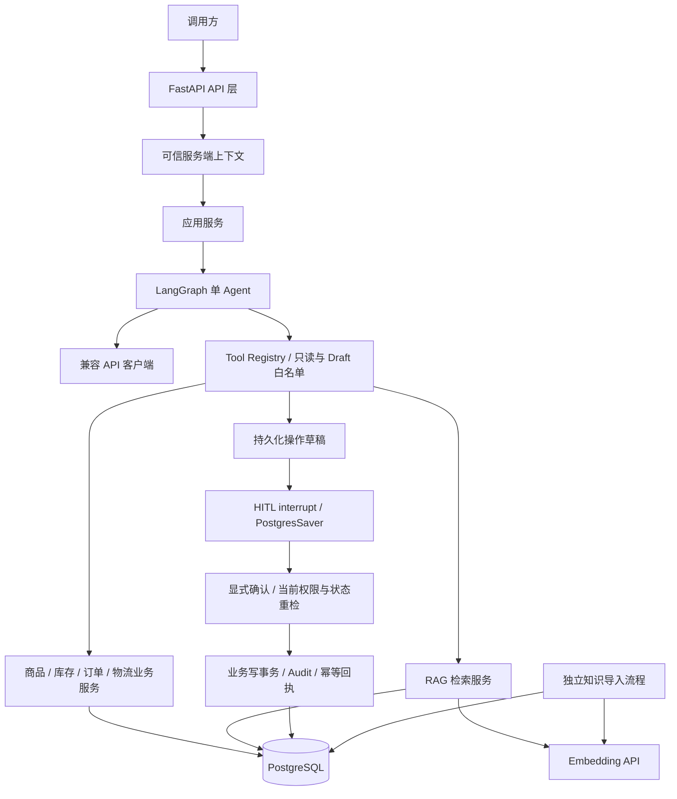
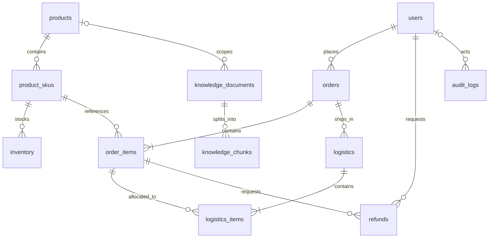
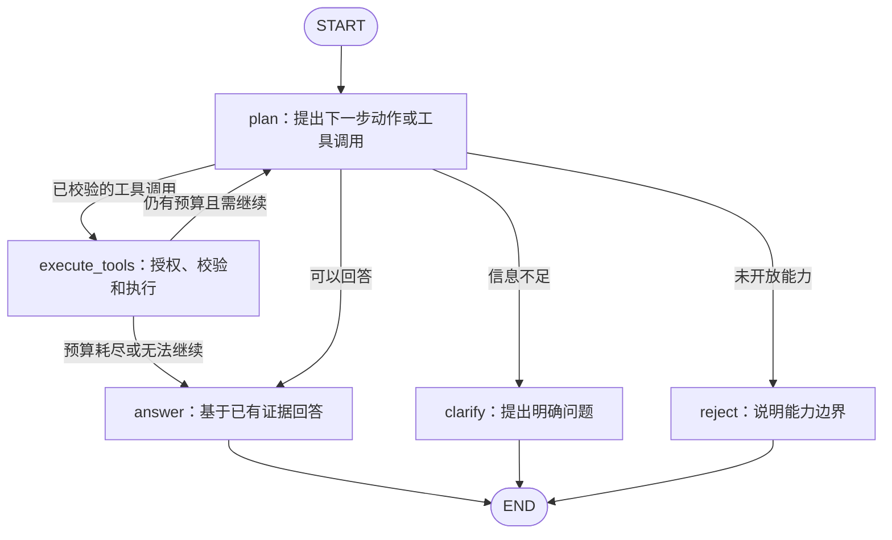

# Ecommerce Ops Agent Architecture

本文件记录当前实现与保留的设计目标；未实现项明确标注。Phase 02–07 已完成本地离线交付，涵盖业务查询、LangGraph、RAG、持久化 HITL、受控写入及 Eval/Observability；Phase 08 未开始。当前状态与验证边界见 [PROJECT_STATE.md](../PROJECT_STATE.md)，指标与失败分析见 [Eval Summary](eval/eval_summary.md)。原始 V0.2 设计保留在 [Phase 01 快照](history/phase01/docs/architecture.md)，不作为当前能力清单。

## 1. 目标与业务范围

建设具有生产级设计思路的电商运营 Agent：模型提出查询请求，受控工具执行，回答绑定真实查询结果及规则出处。初期假设为单商家、自营实物商品、人民币、单仓启用；不设计多租户、预售、支付系统或完整仓库管理。

| 场景 | 数据来源 | 必须遵守的边界 |
|---|---|---|
| 商品咨询 | products、product_skus | 商品参数、价格来自数据库，候选不明确时追问 |
| SKU 查询 | product_skus | SKU 表示具体可售规格，不把产品 ID 当作确定规格 |
| 库存查询 | inventory | 返回可售库存和查询时间，不承诺锁库或未来可售 |
| 订单查询 | orders、order_items | 服务端验证权限及订单归属，返回最小必要字段 |
| 物流查询 | logistics、logistics_items | 同样检查订单权限，支持多个包裹并标注同步时间 |
| 售后规则 | knowledge_documents、knowledge_chunks | 检索适用版本并引用，不把解释表述为退款批准 |

Phase 06 已实现取消/退款申请的 Draft、HITL（人工确认）、幂等事务和业务 Audit；规则与接口见 Phase 06 节。正式认证、真实支付和复杂审批仍未实现。

## 2. 系统架构



| 层 | 职责 | 边界 |
|---|---|---|
| API | 请求校验、可信上下文依赖、HTTP 响应 | 不编写 SQL、提示词或业务判断 |
| 应用服务 | 组织请求生命周期、调用图、转换应用错误和结果 | 不重复具体业务查询规则 |
| Agent | 生成工具调用、处理结果、追问、组织回答 | 不执行 SQL，不授权，不更改可信身份 |
| Tool | 声明类型化输入输出、工具白名单、校验参数、注入上下文 | 不重复业务逻辑，不接受模型提供的权限 |
| 业务服务 | 数据归属、确定性规则、SQLAlchemy 查询与事务 | 不依赖 LangGraph 的 State |
| RAG | 知识导入、分块、向量化、必要过滤、检索和引用 | 不作为实时库存/订单/物流的数据源 |
| 数据库 | ORM、连接、会话、约束、迁移 | 不执行模型推理 |
| LLM 客户端 | 兼容 API 请求、工具调用解析、超时、错误转换 | 不包含业务授权规则 |

业务服务直接使用 SQLAlchemy，不创建泛化 Repository、工厂、插件系统或多供应商抽象层。Agent 不直接访问数据库。Tool 即使被绕过，业务服务仍须执行权限和归属检查。

### 配置与资源生命周期

- 使用统一 Settings 管理 APP_ENV、DATABASE_URL、LLM_BASE_URL、LLM_API_KEY、LLM_MODEL、LLM_TIMEOUT_SECONDS、AGENT_MAX_TOOL_CALLS、RAG_TOP_K。
- Embedding 单独配置 EMBEDDING_BASE_URL、EMBEDDING_API_KEY、EMBEDDING_MODEL、EMBEDDING_DIM，不假设与 Chat 模型来自同一供应商。Phase 02 的 EMBEDDING_DIM 可空，不预设维度，也不做模型启动检查。
- 兼容 API 的工具调用、错误格式和向量接口必须在选定服务后验证，不假设所有供应商完全一致。
- Settings 使用 pydantic-settings；数据库变更使用 Alembic；依赖版本和锁文件在实现时确定。
- DB 会话按工具查询短期持有，不跨模型等待时间保持事务。初版顺序执行工具；将来并发查询时每个任务使用独立 AsyncSession。
- 不运行任意模型生成的 SQL，所有参数通过类型模型校验并绑定到固定查询。
- 初始 Docker Compose 目标只有 API 与 PostgreSQL；不引入缓存或后台消息系统。

## 3. 目标目录结构

以下为未来逐步建立的目标目录，不是实际完成清单。空目录、占位模块和测试不提前批量生成。

```text
ecommerce-ops-agent/
├── PROJECT_STATE.md
├── README.md
├── pyproject.toml
├── .env.example
├── .gitignore
├── .dockerignore
├── Dockerfile
├── compose.yaml
├── alembic.ini
├── migrations/
├── docs/
│   └── architecture.md
├── app/
│   ├── main.py
│   ├── core/
│   │   ├── config.py
│   │   ├── security.py
│   │   └── errors.py
│   ├── api/
│   │   ├── dependencies.py
│   │   └── routes/
│   │       ├── agent.py
│   │       └── health.py
│   ├── schemas/
│   │   ├── agent.py
│   │   └── commerce.py
│   ├── services/
│   │   ├── agent_service.py
│   │   ├── catalog.py
│   │   ├── inventory.py
│   │   └── orders.py
│   ├── agent/
│   │   ├── graph.py
│   │   ├── state.py
│   │   ├── nodes.py
│   │   └── prompts.py
│   ├── tools/
│   │   ├── registry.py
│   │   ├── commerce.py
│   │   └── knowledge.py
│   ├── llm/
│   │   └── client.py
│   ├── rag/
│   │   ├── ingest.py
│   │   ├── retrieval.py
│   │   └── schemas.py
│   └── db/
│       ├── base.py
│       ├── session.py
│       └── models/
│           ├── commerce.py
│           ├── knowledge.py
│           └── audit.py
├── scripts/
│   ├── seed_data.py
│   └── ingest_knowledge.py
└── tests/
    ├── conftest.py
    ├── unit/
    └── integration/
```

Python 参数、返回值和模型字段具有明确类型注解；Pydantic 负责输入输出模型，SQLAlchemy 2.x 使用类型化 ORM 映射。非简单逻辑留下必要的 pytest 检查；PostgreSQL 约束与扩展使用实际 PostgreSQL 集成测试，不用 SQLite 结果替代。

## 4. 数据库 ER 模型

保留原 12 张业务表。Phase 06 新增一张 agent_workflows，合并持久化归属、单操作草稿和事务结果；官方 checkpoint 使用独立 agent_checkpoints schema。以下原业务模型不变，新增设计见 Phase 06 节。



图中订单和包裹至少一条明细属于创建事务需要保证的业务不变量，仅有外键不能保证。

### 4.1 通用字段与约束

- 各表主键 id 为 UUID；订单号、商品编号、SKU 编码等业务标识另设唯一约束。
- 可变实体使用 created_at、updated_at，类型 TIMESTAMPTZ；audit_logs 是追加事件，只保留 created_at。
- paid_at、shipped_at、delivered_at 等业务时间单独记录；时间以 UTC 统一处理，展示时转换时区。
- 金额 NUMERIC(18,2)，Python 使用 Decimal；currency 使用三位货币代码，初期只启用 CNY。
- 数量使用整数并按业务约束非负或大于零。状态使用字符串加数据库 CHECK，Python 枚举与其一致；状态转换由业务服务控制。
- 外键默认限制交易记录删除；商品下架保留历史引用。JSONB 用于规格、快照或受约束的附加信息，不取代关系字段。
- 表中业务必填字段为 NOT NULL；未发生的事件时间、草稿尚未生成的向量等允许为空，具体在迁移中显式约束。

### 4.2 表设计摘要

| 表 | 业务字段（省略通用 id/时间字段） | 约束与语义 |
|---|---|---|
| users | external_subject VARCHAR（可空）、display_name VARCHAR、role VARCHAR、status VARCHAR | external_subject 有值时唯一；开发身份先引用明确的本地用户；role 不由客户端赋值，不设计密码/JWT 登录字段 |
| products | product_code VARCHAR、name VARCHAR、description TEXT、brand VARCHAR、category_code VARCHAR、status VARCHAR | product_code 唯一；商品与可售规格分离 |
| product_skus | product_id UUID FK、sku_code VARCHAR、specs JSONB、spec_key VARCHAR、price NUMERIC、currency CHAR(3)、status VARCHAR | sku_code 唯一；(product_id, spec_key) 唯一；spec_key 是规范化规格标识；price >= 0 |
| inventory | sku_id UUID FK、warehouse_code VARCHAR、on_hand INTEGER、reserved INTEGER | (sku_id, warehouse_code) 唯一；0 <= reserved <= on_hand；初期单仓，不建设仓库主数据系统 |
| orders | order_no VARCHAR、user_id UUID FK、status VARCHAR、payment_status VARCHAR、subtotal_amount/discount_amount/shipping_fee/payable_amount/paid_amount NUMERIC、currency CHAR(3)、shipping_address_snapshot JSONB、paid_at/cancelled_at/completed_at TIMESTAMPTZ | order_no 唯一；金额非负；保存下单地址快照，默认查询不暴露完整地址 |
| order_items | order_id UUID FK、line_no INTEGER、sku_id UUID FK、product_name_snapshot VARCHAR、sku_code_snapshot VARCHAR、specs_snapshot JSONB、quantity INTEGER、unit_price/discount_amount/line_amount NUMERIC | (order_id, line_no) 唯一；数量 > 0；保留成交价格与规格，不跟随当前商品修改 |
| logistics | order_id UUID FK、carrier_code VARCHAR、tracking_no VARCHAR、status VARCHAR、latest_event TEXT、latest_event_at/synced_at/shipped_at/delivered_at TIMESTAMPTZ | 一行对应一个包裹；待发货时可无运单；运单存在时承运商必填，(carrier_code, tracking_no) 唯一；只保留最新状态摘要，不承诺完整轨迹 |
| logistics_items | logistics_id UUID FK、order_item_id UUID FK、quantity INTEGER | (logistics_id, order_item_id) 唯一；quantity > 0；明细与包裹必须属于同一订单 |
| refunds | refund_no VARCHAR、order_item_id UUID FK、requested_by UUID FK users、quantity INTEGER、amount NUMERIC、reason TEXT、status VARCHAR、requested_at/processed_at/refunded_at TIMESTAMPTZ | refund_no 唯一；数量和金额 > 0；按订单明细申请部分退款；运费退款和多明细合并申请后续另定 |
| knowledge_documents | document_key VARCHAR、version INTEGER、title VARCHAR、source_uri TEXT、content TEXT、content_hash VARCHAR、status VARCHAR、scope_type VARCHAR、category_code VARCHAR（可空）、product_id UUID FK（可空）、valid_from/valid_to TIMESTAMPTZ | (document_key, version) 唯一；版本 > 0；范围和有效期显式校验；已发布版本保留历史，不原地覆盖 |
| knowledge_chunks | document_id UUID FK、chunk_index INTEGER、content TEXT、locator VARCHAR、embedding vector、embedding_model VARCHAR | (document_id, chunk_index) 唯一；序号非负；locator 定位原文章节/段落；向量与模型信息同时为空或同时有值；发布前要求完整（发布流程后续实现） |
| audit_logs | actor_id UUID FK（系统事件可空）、request_id UUID、action VARCHAR、resource_type VARCHAR、resource_id UUID（可空）、result VARCHAR、details JSONB | 后续追加写入；resource_id 为跨资源关联标识，不伪称跨表外键；不记录密钥、完整隐私或模型内部推理 |

knowledge_documents 的 scope_type 为 global/category/product：global 不带品类或商品；category 必须带 category_code 且不带 product_id；product 必须带 product_id 且不带 category_code。valid_to 可空，否则必须晚于 valid_from。检索前根据这些字段确定适用范围。

### 4.3 金额、数量和状态

```text
可售库存 = on_hand - reserved
明细金额 = unit_price × quantity - discount_amount
subtotal_amount = Σ(unit_price × quantity)
discount_amount（订单） = Σ(discount_amount（明细）)
payable_amount = subtotal_amount - discount_amount + shipping_fee
```

订单优惠先分摊到明细，便于后续部分退款。单行等式和金额范围使用 CHECK；跨明细求和、关联订单一致性、累积发货/退款限制由业务事务保证，不声称普通 CHECK 能跨行实现。

paid_amount 表示历史成功收款金额，退款不直接扣减该字段，净实收以后从成功退款记录计算。商品单价与下单价格分开，订单明细币种继承订单且必须一致。

| 对象 | 初步状态 |
|---|---|
| 用户 | active / disabled；角色初步 customer / operator |
| 商品 | draft / active / inactive |
| SKU | active / inactive |
| 订单 | pending_payment / pending_fulfillment / partially_shipped / shipped / completed / cancelled / closed |
| 支付 | unpaid / paid / partially_refunded / refunded |
| 物流 | pending / shipped / in_transit / delivered / exception / returned |
| 退款 | requested / approved / rejected / processing / succeeded / failed / cancelled |
| 知识文档 | draft / published / archived |

将来写操作必须在事务内重新检查：包裹属于同一订单、累计发货不超购买量、有效退款申请及成功退款不超可退额度，必要时加锁并实施幂等控制。不能只靠应用输入校验或模型判断。

### 4.4 索引与向量

优先创建业务编号唯一索引、常用外键索引、orders(user_id, created_at)、logistics(order_id)、refunds(order_item_id, status)，以及文档分块的唯一索引。

pg_trgm 仅定义为商品名称和文本的辅助模糊匹配能力；可针对实际查询建立对应索引。中文关键词检索效果未验证，不能将扩展存在视为检索有效。

pgvector 首版从精确向量检索开始；数据量、查询计划和耗时证明必要时再评估近似向量索引。首迁移使用不固定维度的 `vector`，SQLAlchemy 使用 `Vector()`，不创建近似向量索引。参考 [pgvector 可变维度说明](https://github.com/pgvector/pgvector#can-i-store-vectors-with-different-dimensions-in-the-same-column)。

这覆盖并替代原 V0.2 “首迁移固定 vector(D)、启动时核对维度”的安排；不是暗中选择某个维度。未来 RAG 阶段确定模型后，再决定是否用 Alembic 改为 `vector(D)` 并增加配置一致性检查。转换前必须处理已有异维向量；换模型或维度须重新生成 Embedding，不能仅改模型标签或强行截断。未固定维度不代表可混合计算距离：同一检索集合必须使用相同模型/版本与维度，不同维度的距离运算会被 PostgreSQL 拒绝。同维度也不等于同一向量空间。

### Phase 02 落地细则

- 每个外键显式 `ON DELETE RESTRICT`；不设置 ORM delete/delete-orphan 级联。普通外键索引可由以该外键开头的 UNIQUE/联合索引覆盖，避免重复索引。
- 金额范围额外排除 PostgreSQL NUMERIC 的 NaN；订单优惠不超过小计，历史收款额不超过应付额。人民币单币种范围通过 `currency = 'CNY'` CHECK 落实。
- 规格、地址快照和审计 details 必须为 JSON 对象；物流事件尚未发生时，相关摘要/时间及运单字段允许为空。上述是字段约束的实现细化，不增加业务流程。
- `created_at`/`updated_at` 使用数据库时间默认值；`updated_at` 的自动更新由 SQLAlchemy 发起。未来绕过 ORM 的 SQL 写入必须显式更新时间，本轮不加触发器。
- 包裹与明细同订单、至少一条明细、跨行金额合计、累计发货/退款额度、知识发布完整性与版本有效期冲突，仍由后续业务事务保证；本轮未实现、未验证这些业务约束。
- `audit_logs` 仅有追加事件表结构，无 `updated_at`；本轮未建立禁止 UPDATE/DELETE 的独立运行角色或审计写入服务。运行时最小权限分离留到业务查询接入前实施。
- `/health/live` 只报告 API 存活；`/health` 执行有超时的 `SELECT 1`，数据库不可达返回 503，响应不暴露连接信息。健康检查不代表数据库迁移完整，迁移由独立命令执行。
- 应用 lifespan 管理 Engine 和 sessionmaker；依赖每次创建并关闭独立 AsyncSession，不自动提交业务事务。可信上下文依赖默认 401，只允许未来认证实现或测试显式覆盖。

### Phase 02.2 实现边界

- 保持 V0.2 表、外键和首迁移不变；迁移往返在独立空测试库执行。降级保留既有共享扩展及 Alembic 自有版本表，删除业务表、约束和索引。
- Seed 使用固定业务键和由键派生的 UUID，只补缺失记录，保留已有修改；事务提交由显式开发/测试命令负责，生产环境拒绝执行。知识样例只写 draft 文档，不生成分块/向量，不制造审计日志。
- Phase 02 查询 Service 直接使用 SQLAlchemy 并返回 Pydantic 结构，该阶段未接 Tool 或业务 HTTP。商品/库存只展示 active 商品及 active SKU；历史订单继续返回下单快照，不受当前商品下架影响。
- 商品查询使用名称字面子串与可选品类过滤、SKU 使用 JSONB 规格包含过滤；无模糊排序、语义检索或新增文本索引。查询输入设长度与条数上限，排序固定以便重复测试。
- 订单和物流共用服务端权限及归属校验；`orders:read:any` 才能跨用户访问，不从 operator 角色标签推断权限。不存在和不可访问使用同一结构化错误码，订单结果省略完整地址和用户身份字段。
- 物流查询在包裹授权后仍过滤明细的同订单关系；这只是查询防泄露，不替代未来写事务中的跨订单一致性校验。
- 正式认证、数据库运行角色分离仍未实现，作为未来开放业务接口之前的前置要求；不是本轮本地 Service 测试已验证的能力。

## 5. LangGraph 设计

单 Agent、显式 State、有限 Tool Loop（带调用上限的工具循环）。不增加独立分类、规划或审核 Agent。

下图与本节 Phase 04 合约描述保留的只读 `run_agent` 入口；持久化入口增加的 `confirm_operation`、Draft 和结果字段见 Phase 06 节。



图中的分支由通过结构校验的动作/工具调用和确定性预算条件控制，不读取 intent 决定路径。即便 plan 没有正确识别写操作，execute_tools 的只读白名单仍会拒绝执行。

| 节点 | 职责 |
|---|---|
| plan | 从用户问题和已有工具结果生成工具调用、回答、追问或能力边界说明；可附带用于观测的 intent 标签 |
| execute_tools | 白名单、参数校验、调用数量和权限检查；注入可信上下文并调用业务服务；收集结构化结果 |
| answer | 使用真实结果、规则引用及数据时间组织答案；缺数据或部分失败时明确说明 |
| clarify | 缺商品、规格或订单信息时提出必要问题，不替用户随意选一个候选 |
| reject | 告知写操作等未开放能力；该节点是用户体验路径，不是唯一安全屏障 |

### State 与可信上下文

| 类别 | 字段与类型意图 |
|---|---|
| State | messages：类型化消息序列；intent：可空观测标签；evidence：Evidence 列表；tool_call_count：整数；errors：AgentError 列表；decision：已校验的终结动作或 null；final_response：FinalResponse 或 null |
| 服务端上下文 | AgentContext：不可变 RequestContext（actor_id/permissions/request_id）、Model、短期 Session 工厂、Settings；截止时间由 run_agent 的 asyncio.timeout 管理 |

intent 仅用于可观测性、日志和未来 Eval，不驱动权限、安全决策、工具授权或流程路由。改变 intent 而不改变真实上下文与工具参数，不应改变授权结果。

Phase 04 删除旧设计中的 resolved_entities：候选实体已经包含在 Tool Result 和消息里，单独维护会重复且可能失配。decision 是真实路由需要的类型化动作，不替代授权；模型提供的实体标识仍须经过业务服务检查。身份与权限不从 State、用户消息或工具参数回填。数据库会话、客户端和密钥不作为可持久化 State 字段。

### Phase 04 实现合约

- `app/agent/llm.py`：Model Protocol 与 OpenAICompatibleModel，使用现有 httpx 发 Chat Completions 请求。LLM_BASE_URL/API_KEY/MODEL/TIMEOUT_SECONDS 均来自 Settings，不硬编码供应商；缺配置返回 llm_not_configured。无自动重试、重定向或真实 API 测试依赖。
- `app/agent/state.py`：TypedDict State 和 Pydantic Decision/Evidence/FinalResponse；Evidence 保存服务端编号、tool_call_id、原 ToolResult。模型只能选择本次成功证据编号，不能提供事实值或自由答案。终结 JSON 由本地 Schema 校验，错误输出不会作为自然语言直通。
- `app/agent/graph.py`：真实 StateGraph，START → plan → execute_tools/clarify/reject/answer；execute_tools 顺序执行并回 plan。超额调用转 answer，未注册调用经 Registry 返回 unknown_tool 后转 reject。三个终结分支均通往 END。
- plan 通过协议消息读取用户请求与此前工具结果；模型自行选择工具及参数。达到调用上限后仍允许最后一次模型汇总，此时不提供工具；若仍生成调用，每个调用返回 tool_call_limit，不再进入 Service。
- 默认最多 8 次工具尝试、24 个图步骤、单模型请求 30 秒、整请求 90 秒；分别由 AGENT_MAX_TOOL_CALLS、AGENT_MAX_GRAPH_STEPS、LLM_TIMEOUT_SECONDS、AGENT_TIMEOUT_SECONDS 配置。非法/未知工具尝试也计数，批量请求逐项检查；数据库沿用原连接/池/命令的 3 秒边界。
- AgentContext 通过 LangGraph 的 context_schema/runtime.context 传递，模型只能看到 Schema 和消息。execute_tools 每次用独立 AsyncSession，结束时回滚/关闭，不提交业务事务。工具自身的参数、权限、归属、SQL 和临时错误转换保持 Phase 03 实现。
- 模型 timeout、API/网络/协议错误转安全代码；Tool 五种状态保留。整请求超时和图步数耗尽保留此前成功结果，未完成 Tool Calls 补终止消息。运行流中的每次工具进度仅供本次请求恢复部分结果，不是 checkpoint。程序缺陷及调用方主动取消继续向上传播。
- answer 采用保守的证据引用模式：模型选结果，代码呈现完整 Tool data 与来源/时间，不接受模型自由事实或改写字段。clarify 只接受一个问题类型，reject 只接受能力原因类型。所有失败结果强制带回；部分成功标 partial，无有效证据标 unconfirmed。ok 仅指所引用查询成功，不证明用户需求已被语义上完整回答。
- 该模式确保输出事实来自 Tool Result，尚不保证模型选中了最相关对象或最必要问题；完整数据引用可能较长。真实模型兼容性、工具选择质量和自然语言效果仍需后续明确的 live/Eval 验证。无业务 HTTP 路由或正式认证接入。

### Tool 合约

Phase 03 实现下表前六项，Phase 05 在原 Registry 增加 `search_after_sales_policy`。输入见 `app/schemas/tools.py`、`app/rag/schemas.py`。订单 Tool 只接受 `order_no`，Service 仍保留双标识能力；Phase 05 未修改原 Business Services、ORM 或迁移。

| Tool | 模型可提供的主要参数 | 返回内容 |
|---|---|---|
| search_products | query、可选品类、有上限的 limit | 商品候选、ID 和摘要 |
| get_product | product_id | 已授权可见的商品详情 |
| list_product_skus | product_id、规格筛选 | SKU ID、规格、价格和状态 |
| get_inventory | sku_id、可选仓库编码 | 可售库存、查询时间 |
| get_order | order_no | 已授权订单状态、金额和明细 |
| get_logistics | order_no | 已授权订单的包裹、商品数量、运单、最新状态和同步时间 |
| search_after_sales_policy | query、可选 product_id/category/relevant_date/limit | 规则片段、文档/版本/分块 ID、来源、定位、适用范围和检索名次 |

工具参数不包含 actor_id 或 permissions。按 Phase 05 明确范围，政策工具不接受 order_id、不读取订单；订单先经过原 get_order 授权，再核对商品/SKU。relevant_date 仅是显式查询条件，不能被当作可信历史政策适用结论；订单事件时间选择及历史商品品类仍未自动解决。这替代此前关于本阶段直接接收 order_id 的设想。

Phase 03 统一 `ToolResult[T]` 包含 status、具体类型的 data、source（工具名）、queried_at、可信 request_id 及可公开的 error。状态为 success、not_found、forbidden、invalid_argument、temporarily_unavailable。商品/SKU 空列表或实体缺失为 not_found；已授权订单无包裹仍为 success；库存缺记录不等于已知零库存。物流保留 synced_at。

`OrderNotAccessible` 对 self 范围调用者一律转为 forbidden，不区分他人订单与不存在订单；只有已有 `orders:read:any` 的上下文可把该异常解释为 not_found。权限与归属仍由 Service 检查，Tool 不额外探测订单存在性。模型参数之外单独传入服务端 RequestContext，所有额外参数拒绝，白名单为不可变显式映射，无动态导入或自动注册。输入/输出 JSON Schema 可通过 `tool_schemas()` 读取。

已识别临时故障转换成固定安全错误，不暴露数据库或输入内容；程序缺陷、非临时数据库错误和错误 Service 输出结构继续抛出，不能标成 invalid_argument 或临时故障。Phase 04 Agent 为每次调用创建并关闭/回滚会话，Tool 不提交事务。每个已接收模型工具调用都对应工具结果或明确的超额/中断消息，不伪造未执行工具的业务 evidence。

设置请求超时、数据库超时、总调用次数和图步数上限；上限不得由模型修改。Phase 04 顺序执行，不加自动重试器；模型收到结果后提出的后续调用仍计入总预算，Service 会重新校验权限。没有数据不能被解释成系统故障，系统故障也不能伪装成没有订单。

### 会话边界

旧 run_agent 入口不配置 checkpoint；新 Phase 06 Service 使用持久化工作流和检查点恢复。追问后仍发起带必要上下文的新请求，历史用户/模型文本不作为可信业务证据，实时状态重新查询。

HITL 的持久化归属与恢复授权已实现；数据保留/归档策略尚未实现。

## 6. 安全边界与 Phase 02 身份方案

Phase 02 不实现完整 JWT 登录，但可信服务端上下文从工程入口保留。开发/测试阶段可由服务端固定配置映射一个明确的本地 actor，或通过测试依赖注入；这种方式只能验证授权逻辑，不等于正式认证。

1. actor_id 由服务端依赖给定，permissions 由服务端明确配置的权限映射产生；request_id 由服务端生成。客户端不能用请求体、任意 Header、URL 参数或模型指令冒充另一个 actor 或权限。
2. 开发身份仅在明确的开发/测试环境启用。非开发环境缺少正式认证时启动失败或拒绝业务请求；开发接口限制在本机，不当作公网服务部署。
3. 查询本人订单要求 orders:read:self，查询条件包含 orders.user_id = actor_id。只有明确授予 orders:read:any 的服务端上下文才可跨用户查询，不能仅凭 operator 文本标签放行。
4. 物流查询、通过订单派生的售后查询也走相同订单归属检查；不允许从另一条工具路径绕过。
5. 业务服务重复承担最后的权限检查，不能只在路由或提示词中限制。所有工具使用最小返回字段，默认不向模型输出完整地址、电话等隐私信息。
6. Phase 05 白名单含七个已实现只读工具；入库不是 Tool。未注册工具、写操作或动态 SQL 一律拒绝。运行时只读查询与迁移/数据导入权限分离仍是正式开放前的待实现要求。
7. 商品描述、检索文档和用户文本均为不可信数据，其中出现的指令不能修改系统权限、工具列表或执行上限。
8. 设置输入长度、分页上限、参数类型、超时和错误转换。日志脱敏，不记录密钥、完整消息正文和敏感工具结果。

后续正式认证替换可信上下文的来源，保持业务服务的归属校验不变。Phase 06 已实现操作草稿、人工确认、重新校验、幂等事务与审计；写工具仅在持久化入口开放，不提供通用工作流。

## 7. RAG 边界

Phase 05 实际实现：现有两张知识表 + 空行规则分块/字符 locator + httpx Embedding Adapter + 精确余弦与简单关键词召回 + RRF。两路均过滤状态、有效期和范围，同 key 选择适用最高版本。现有 `Vector()` 足够：请求响应验证维度，SQL CASE 排除异模型/异维度的距离运算，不修改首迁移。关键词允许召回非当前向量空间的已发布原文，不将其伪装为向量命中。

入库使用 SHA-256、文档业务键事务锁及 SAVEPOINT；同版本重复跳过，草稿内容更新原子替换 chunk，已发布/归档内容变更须升版本。保持原始文档版本不变时可重建派生 chunk；命令负责整批提交。规则冲突不自动裁决，scope 不是优先级。全部样例显式标注模拟数据。操作命令见 [README](../README.md#quick-start)，评估口径见 [Eval Summary](eval/eval_summary.md)。

RAG（检索增强生成）用于相对稳定的售后政策和说明资料。价格、库存、订单和物流仍由数据库工具查询，不能从旧知识片段中推断实时业务事实。

### 当前检索流程

```text
独立导入：可信资料 → 文档版本/范围/有效期 → 分块与定位 → Embedding → PostgreSQL
在线查询：问题及经校验的范围 → 发布/日期/范围过滤 → 精确向量检索 + 简单关键词
          → RRF 合并、去重、截取结果 → 带原文证据和出处回答
```

- 必要过滤包含发布可见性、商品/品类适用范围、有效期及资料访问范围，两条检索路径应用相同过滤。
- 当前仅检索 published 文档；日期由显式 relevant_date 或当前时间给出，未自动从订单事件派生。archived 文档不会返回，历史品类快照与完整历史政策适用仍未解决。
- 同 key 选择适用最高版本；没有完整的发布有效期冲突检查与跨文档规则裁决。全局/品类/商品 scope 不能被解释为优先级。
- 第一版没有 Reranker（对候选资料进行额外模型排序的组件），也不安装其依赖或预建模块。去重和简单排名合并不等于已验证的检索质量。
- 数据库安装 pg_trgm，但当前商品搜索是字面子串，RAG 关键词使用中文二元组、英文词与字面匹配；未使用 pg_trgm 相似度排序。真实中文语义召回尚未验证。
- 必须用真实测试数据和后续 Eval（固定样本上的效果评估）确认中文召回、排序与引用质量；只有 Eval 显示明显排序问题，才评估是否需要 Reranker。
- 来源应包含 document_id、version、chunk_id、source_uri、locator；引用必须对应真实返回的片段，不能只生成一个看似合理的链接。
- 缺失适用规则、历史版本或可靠来源时明确无法确认，不把相似度当作正确概率，也不将规则解释等同退款批准。
- 文档检索内容不能控制工具权限；知识导入不是 Agent 对外开放的工具。

## 8. 后续验证要求与扩展条件

以下为实现后的验证要求，不是已通过的测试：

- 通过服务端上下文验证本人订单可读、他人订单及物流不可读、明确授权的运营身份可跨用户查询。
- 伪造 actor/permissions、改变 intent、猜测订单号、从售后工具间接访问订单，均不能绕过授权。
- 校验数据库唯一约束、外键、金额/数量、规格快照、拆包关系及规则有效期；写操作并发检查到对应阶段实施。
- 工具未注册、参数错误、无结果、模型/DB 超时和循环超限都产生明确结果，不伪造成功。
- 验证模型供应商的工具调用兼容性、向量模型和维度一致性。
- 使用中文商品及售后样本评估首版检索，覆盖无答案、过期规则、历史订单、规则冲突及引用准确性。
- Mock 测试、真实模型测试、本地 Docker 结果与生产运行证据分别报告。

当前不增加 Multi-Agent、Redis、消息队列、微服务或泛化 Repository。Reranker 仅在 Eval 显示明显排序问题后评估；持久化 checkpoint 已按 Phase 06 授权加入，数据保留与负载扩展仍待后续明确范围。

## 9. 技术参考

以下为 V0.1 设计时已查阅的技术依据，不能代替本项目实现验证：

- [LangGraph Graph API](https://docs.langchain.com/oss/python/langgraph/graph-api)：State、节点、条件边和执行上限。
- [SQLAlchemy AsyncSession 并发边界](https://docs.sqlalchemy.org/en/20/orm/extensions/asyncio.html#using-asyncsession-with-concurrent-tasks)：并发任务使用独立会话。
- [PostgreSQL pg_trgm](https://www.postgresql.org/docs/current/pgtrgm.html)：辅助字符相似度匹配与索引。
- [pgvector 官方项目](https://github.com/pgvector/pgvector)：向量存储及精确/近似检索能力。


## Phase 06 设计审计与实现

### 最小 Schema 调整

原 12 表可以保存业务结果，却没有 durable thread owner、不可变草稿绑定和取消订单的幂等回执。refund_no 的唯一约束只能保护退款记录，不能同时证明哪个用户确认了哪个操作。内存会随进程退出消失；只放在 LangGraph State 中，业务提交和 checkpoint 保存又不在同一事务，重试存在重复执行窗口。

新增 Alembic `0002` 的 `agent_workflows` 一表合并三种必要职责：`id` 为 thread UUID；`actor_id` 外键和 `(actor_id, request_key)` 唯一约束绑定所有者及初始请求；`operation_id` 可空且唯一；`draft` 保存原始结构化参数和状态快照；`confirmation` 绑定首次 confirm/reject；`status/result` 保存事务结果。另保存初始可信 request_id 和输入哈希，用于请求重试及误用检测。一请求最多一个操作；没有审批人分配表、通用状态机或操作历史表。

`0001` 和原 12 表保持不变，新增表不回填/改写既有业务记录。降级 0002 会删除工作流数据，不能在有待确认/已执行回执的环境随意降级。往返测试仅在既有专用空库运行。官方 checkpoint 的 setup 单独显式执行，不在应用启动执行 DDL，不由 Alembic 管理或降级；checkpointer 包升级前需核对其自有 migrations。

### Checkpoint 与恢复

使用官方 `langgraph-checkpoint-postgres` 的 PostgresSaver，表位于独立 `agent_checkpoints` schema（checkpoints、checkpoint_blobs、checkpoint_writes、checkpoint_migrations）。Windows 默认 Proactor 不兼容 psycopg 异步连接，因此用 `asyncio.to_thread` 桥接官方同步 Saver 的三项异步图方法；不自建 checkpoint 存储格式、不修改全局事件循环。关闭 pickle fallback，明确允许当前 State 的四种 Pydantic 类型，不公开任意 checkpoint/history/state-update API。

`build_graph(checkpointer=...)` 复用原 plan、只读工具、RAG 和 evidence，新增 `confirm_operation` 节点。写工具只创建持久化 Draft，实际业务写入前调用 LangGraph `interrupt(draft)`；每步使用 sync durability。Runtime Context 不写入 checkpoint，恢复时重新注入可信 actor、当前 permissions、Session 工厂和模型。只有 API Service 可以生成带确认值的 Command，LLM 和初始消息中的 confirm 不参与授权。

图运行前先查工作流 owner，再通过 PostgreSQL session advisory lock 串行化同一 thread 的图调用；无跨用户全局锁。连接关闭或进程退出释放锁。锁等待 5 秒，超时返回存储暂不可用，由调用方使用同一身份重试。模型调用期间没有业务行锁；执行写事务时另取 workflow 行锁，再取 order、必要的 order_item 行锁。

持久化草稿先于 checkpoint，节点重放复用同一草稿/operation_id。首次确认选择先落库，重试不能改成另一个选择。业务变更、Audit、最终 result 在同一 SQLAlchemy 事务提交：即使业务提交后 checkpoint 保存失败，重试仍返回该回执而不再写入。终态重试是读取旧结果，不是重新授权一个新操作；operation_id 必须匹配，权限/owner 每次重新检查。

### 两类操作与规则

- `request_order_cancellation(order_no, reason)`：只允许本人 `pending_payment`、`unpaid`、零实收、无物流及退款记录的订单。更新 status=cancelled 和 cancelled_at，不改历史支付/金额。已付款待履约取消需要准确释放库存预留，但现有 inventory.reserved 没有订单级预留归属，所以本阶段明确不支持它。
- `create_refund_request(order_no, order_item_id, quantity, amount, reason)`：本人且明细属于同订单；订单为 pending_fulfillment/partially_shipped/shipped/completed，支付为 paid/partially_refunded 且已足额付款。requested/approved/processing/succeeded 都占用额度，rejected/failed/cancelled 不占用。数量不超明细剩余量；金额不超明细剩余额、当前数量按明细成交价比例向下取分的金额、整单已付款剩余额三者最小值。运费退款不支持。优惠分摊的不足一分余数保守舍去，不自动补齐。
- Resume 在锁内重新查询所有规则数据并比较原状态快照；订单/明细更新时间、状态、付款额或剩余额变化均拒绝旧 Draft。需要重新发起新请求并确认，不能静默重算金额后执行。
- 退款仅插入 requested 记录，refund_no=`OP-{operation_id}` 复用既有唯一约束；不审批、不打款，不修改 payment_status/paid_amount、库存或物流。

受控 Draft 包含 operation_id、operation_type、actor、target（order_id/order_no/可选 item ID）、parameters、current_state、expected_change 和 confirmation_summary。只有可信代码生成 operation/thread UUID；输入拒绝额外字段。没有 arbitrary SQL、update_order_status 或 insert_refund 工具。七项只读 TOOLS 与两项 WRITE_TOOLS 分开，旧 run_agent 入口仍为无 checkpoint 的只读模式；写工具只在 durable service 模式开放。

### Audit 与失败

成功、显式 reject、业务冲突和可记录的业务写失败各有一个 Audit，重复调用复用回执，不增加重复审计。包含可信 actor/request_id、operation/thread/初始 request_id、action、resource、result、时间和固定安全变更摘要。原因文本和模型消息不进入 Audit。

reject 不更新订单、不创建退款；仍保存拒绝回执及 Audit。写入 SQL 失败先回滚 SAVEPOINT，再保存 failed 回执与失败 Audit。Audit 自身失败则整个业务事务回滚，不报告成功；工作流保持等待确认、保留第一次选择，可用同一选择重试。数据库整体不可用时无法保证额外失败 Audit，此时 API 返回固定 503；预草稿参数/归属/规则拒绝记录为 ToolResult/检查点，不产生实际业务操作 Audit。

所有本阶段写服务遵循父订单锁协议。未来支付、物流、退款审批等新写入也必须在同一锁协议下重读状态；直接管理员 SQL、绕过服务的写入不在安全承诺内。未实施数据库审计表只追加权限和运行/迁移角色分离，不宣称可抵抗数据库管理员篡改。

### API 与身份

- POST `/agent/requests`：`{request_key: UUID, message: string}`；同一用户重试相同 key 和相同正文复用 thread，不同正文返回 409。
- GET `/agent/threads/{thread_id}`：只读取本人的工作流安全投影。
- POST `/agent/threads/{thread_id}/resume`：`{operation_id: UUID, decision: "confirm" | "reject"}`；无模糊确认、无参数编辑和状态注入。

所有工作流响应共用历史证据授权入口，包括 GET、相同 request_key 和终态 Resume。当前 active actor 校验后，从成功的 get_order/get_logistics evidence 取订单 ID，去重并复用 orders Service 的 authorize_order_access；该函数沿用原 _authorized_order 的当前权限和真实订单 ownership 条件。read:any 降为 read:self 后，他人订单仍拒绝；受保护 ID 缺失或非法也拒绝。拒绝整个响应，避免已渲染 text 泄露证据。普通商品证据不要求订单权限；只检查访问资格，不重跑 Agent 或调用 LLM。后续受保护 evidence source 在公共入口增加资源映射及所属 Service 授权。

默认身份依赖仍返回 401。仅 development/test 可显式配置 DEV_ACTOR_ID 为现有本地用户，服务端固定授予 orders:read:self、orders:cancel:self、refunds:request:self；每次检查用户 active。production 拒绝该配置。Header/请求体不能指定 actor/permissions。正式认证仍未接入，此开发入口只在本机使用。

参考：[官方 Interrupt/Resume 语义](https://docs.langchain.com/oss/python/langgraph/interrupts)、[官方 Postgres checkpoint 包](https://pypi.org/project/langgraph-checkpoint-postgres/)。实际验证结果以 PROJECT_STATE 为准。


## Phase 07 Eval & Observability

评估入口 `scripts/agent_eval.py` 复用 Agent/Registry/RAG 和 Phase 06 PostgreSQL 夹具；独立版本化 oracle 不进入模型消息。Fake 脚本只衡量指定轨迹执行，Live 子集才用于模型能力评估，评分和限制见 [Eval Summary](eval/eval_summary.md)。

检索增加仅由内部评估入口选择的 vector/keyword/hybrid 模式，业务 Tool Schema 不暴露 mode，默认 Hybrid 行为不变，未引入 Reranker。日志使用标准库 logging/ContextVar 与字段白名单，贯穿模型、工具、检索和持久化发起/恢复，完整业务结果不进入开发日志。评估数据只在专用测试库回滚或按本轮 UUID 清理，无新业务 Tool、迁移或监控平台。
