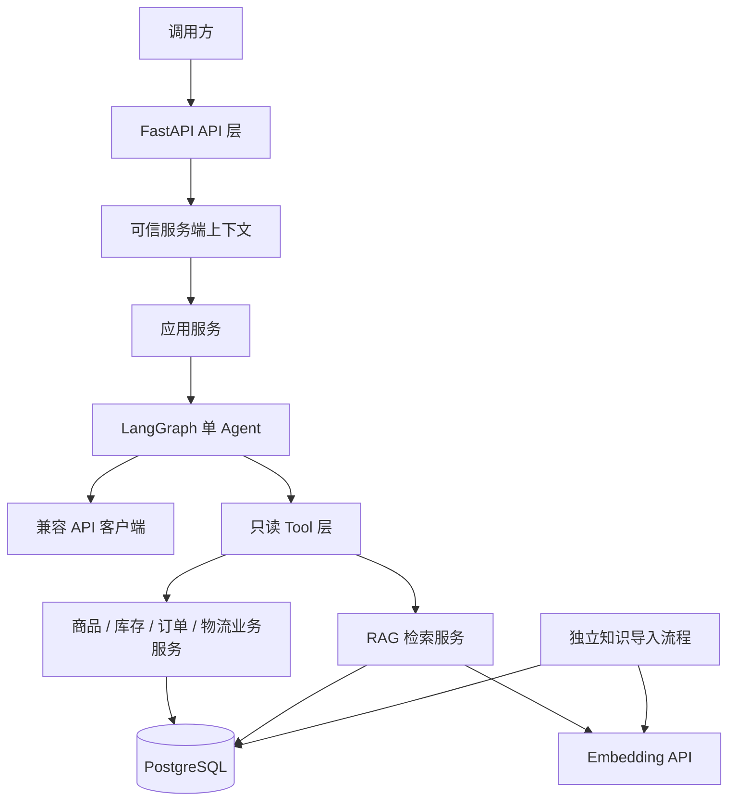
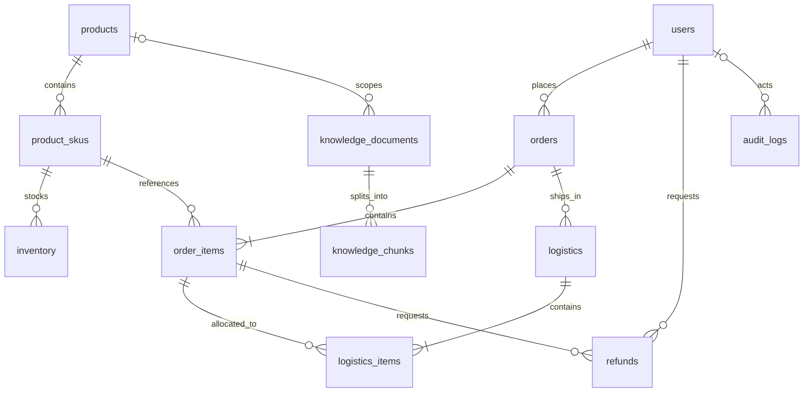
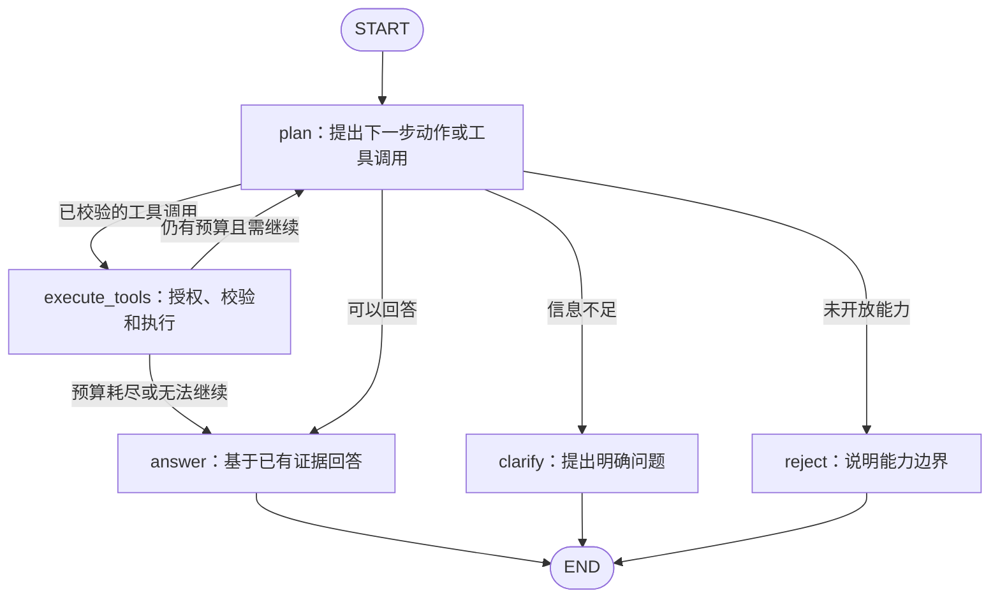

# ecommerce-ops-agent 架构设计 V0.2

本文件描述目标架构，不表示相应能力已经实现。当前阶段、实际目录、完成状态与待验证事项统一见 [PROJECT_STATE.md](../PROJECT_STATE.md)。

## 1. 目标与业务范围

建设具有生产级设计思路的电商运营 Agent：模型提出查询请求，受控工具执行，回答绑定真实查询结果及规则出处。初期假设为单商家、自营实物商品、人民币、单仓启用；不设计多租户、预售、支付系统或完整仓库管理。

| 场景 | 数据来源 | 必须遵守的边界 |
|---|---|---|
| 商品咨询 | products、product_skus | 商品参数、价格来自数据库，候选不明确时追问 |
| SKU 查询 | product_skus | SKU 表示具体可售规格，不把产品 ID 当作确定规格 |
| 库存查询 | inventory | 返回可售库存和查询时间，不承诺锁库或未来可售 |
| 订单查询 | orders、order_items | 服务端验证权限及订单归属，返回最小必要字段 |
| 物流查询 | logistics、logistics_items | 同样检查订单权限，支持多个包裹并标注同步时间 |
| 售后规则 | knowledge_documents、knowledge_chunks | 检索适用版本并引用，不把解释表述为退款批准 |

取消/退款申请、业务写操作、HITL（人工确认）、幂等控制、业务审计、正式认证和持续会话后续逐步实现。设计 refunds 和 audit_logs 表不等于提供对应写工具。

## 2. 系统架构



| 层 | 职责 | 边界 |
|---|---|---|
| API | 请求校验、可信上下文依赖、HTTP 响应 | 不编写 SQL、提示词或业务判断 |
| 应用服务 | 组织请求生命周期、调用图、转换应用错误和结果 | 不重复具体业务查询规则 |
| Agent | 生成工具调用、处理结果、追问、组织回答 | 不执行 SQL，不授权，不更改可信身份 |
| Tool | 声明类型化输入输出、工具白名单、校验参数、注入上下文 | 不重复业务逻辑，不接受模型提供的权限 |
| 业务服务 | 数据归属、确定性规则、SQLAlchemy 查询与事务 | 不依赖 LangGraph 的 State |
| RAG | 知识导入、分块、向量化、必要过滤、检索和引用 | 不作为实时库存/订单/物流的数据源 |
| 数据库 | ORM、连接、会话、约束、迁移 | 不执行模型推理 |
| LLM 客户端 | 兼容 API 请求、工具调用解析、超时、错误转换 | 不包含业务授权规则 |

业务服务直接使用 SQLAlchemy，不创建泛化 Repository、工厂、插件系统或多供应商抽象层。Agent 不直接访问数据库。Tool 即使被绕过，业务服务仍须执行权限和归属检查。

### 配置与资源生命周期

- 使用统一 Settings 管理 APP_ENV、DATABASE_URL、LLM_BASE_URL、LLM_API_KEY、LLM_MODEL、LLM_TIMEOUT_SECONDS、AGENT_MAX_TOOL_CALLS、RAG_TOP_K。
- Embedding 单独配置 EMBEDDING_BASE_URL、EMBEDDING_API_KEY、EMBEDDING_MODEL、EMBEDDING_DIM，不假设与 Chat 模型来自同一供应商。
- 兼容 API 的工具调用、错误格式和向量接口必须在选定服务后验证，不假设所有供应商完全一致。
- Settings 使用 pydantic-settings；数据库变更使用 Alembic；依赖版本和锁文件在实现时确定。
- DB 会话按工具查询短期持有，不跨模型等待时间保持事务。初版顺序执行工具；将来并发查询时每个任务使用独立 AsyncSession。
- 不运行任意模型生成的 SQL，所有参数通过类型模型校验并绑定到固定查询。
- 初始 Docker Compose 目标只有 API 与 PostgreSQL；不引入缓存或后台消息系统。

## 3. 目标目录结构

以下为未来逐步建立的目标目录，不是实际完成清单。空目录、占位模块和测试不提前批量生成。

```text
ecommerce-ops-agent/
├── PROJECT_STATE.md
├── README.md
├── pyproject.toml
├── .env.example
├── .gitignore
├── .dockerignore
├── Dockerfile
├── compose.yaml
├── alembic.ini
├── migrations/
├── docs/
│   └── architecture.md
├── app/
│   ├── main.py
│   ├── core/
│   │   ├── config.py
│   │   ├── security.py
│   │   └── errors.py
│   ├── api/
│   │   ├── dependencies.py
│   │   └── routes/
│   │       ├── agent.py
│   │       └── health.py
│   ├── schemas/
│   │   ├── agent.py
│   │   └── commerce.py
│   ├── services/
│   │   ├── agent_service.py
│   │   ├── catalog.py
│   │   ├── inventory.py
│   │   └── orders.py
│   ├── agent/
│   │   ├── graph.py
│   │   ├── state.py
│   │   ├── nodes.py
│   │   └── prompts.py
│   ├── tools/
│   │   ├── registry.py
│   │   ├── commerce.py
│   │   └── knowledge.py
│   ├── llm/
│   │   └── client.py
│   ├── rag/
│   │   ├── ingest.py
│   │   ├── retrieval.py
│   │   └── schemas.py
│   └── db/
│       ├── base.py
│       ├── session.py
│       └── models/
│           ├── commerce.py
│           ├── knowledge.py
│           └── audit.py
├── scripts/
│   ├── seed_data.py
│   └── ingest_knowledge.py
└── tests/
    ├── conftest.py
    ├── unit/
    └── integration/
```

Python 参数、返回值和模型字段具有明确类型注解；Pydantic 负责输入输出模型，SQLAlchemy 2.x 使用类型化 ORM 映射。非简单逻辑留下必要的 pytest 检查；PostgreSQL 约束与扩展使用实际 PostgreSQL 集成测试，不用 SQLite 结果替代。

## 4. 数据库 ER 模型

保留 12 张业务表。logistics_items 是拆包关系的必要明细，knowledge_chunks 是知识分块及引用定位的必要载体。不增加会话表、checkpoint 表或通用业务操作表。



图中订单和包裹至少一条明细属于创建事务需要保证的业务不变量，仅有外键不能保证。

### 4.1 通用字段与约束

- 各表主键 id 为 UUID；订单号、商品编号、SKU 编码等业务标识另设唯一约束。
- 可变实体使用 created_at、updated_at，类型 TIMESTAMPTZ；audit_logs 是追加事件，只保留 created_at。
- paid_at、shipped_at、delivered_at 等业务时间单独记录；时间以 UTC 统一处理，展示时转换时区。
- 金额 NUMERIC(18,2)，Python 使用 Decimal；currency 使用三位货币代码，初期只启用 CNY。
- 数量使用整数并按业务约束非负或大于零。状态使用字符串加数据库 CHECK，Python 枚举与其一致；状态转换由业务服务控制。
- 外键默认限制交易记录删除；商品下架保留历史引用。JSONB 用于规格、快照或受约束的附加信息，不取代关系字段。
- 表中业务必填字段为 NOT NULL；未发生的事件时间、草稿尚未生成的向量等允许为空，具体在迁移中显式约束。

### 4.2 表设计摘要

| 表 | 业务字段（省略通用 id/时间字段） | 约束与语义 |
|---|---|---|
| users | external_subject VARCHAR（可空）、display_name VARCHAR、role VARCHAR、status VARCHAR | external_subject 有值时唯一；开发身份先引用明确的本地用户；role 不由客户端赋值，不设计密码/JWT 登录字段 |
| products | product_code VARCHAR、name VARCHAR、description TEXT、brand VARCHAR、category_code VARCHAR、status VARCHAR | product_code 唯一；商品与可售规格分离 |
| product_skus | product_id UUID FK、sku_code VARCHAR、specs JSONB、spec_key VARCHAR、price NUMERIC、currency CHAR(3)、status VARCHAR | sku_code 唯一；(product_id, spec_key) 唯一；spec_key 是规范化规格标识；price >= 0 |
| inventory | sku_id UUID FK、warehouse_code VARCHAR、on_hand INTEGER、reserved INTEGER | (sku_id, warehouse_code) 唯一；0 <= reserved <= on_hand；初期单仓，不建设仓库主数据系统 |
| orders | order_no VARCHAR、user_id UUID FK、status VARCHAR、payment_status VARCHAR、subtotal_amount/discount_amount/shipping_fee/payable_amount/paid_amount NUMERIC、currency CHAR(3)、shipping_address_snapshot JSONB、paid_at/cancelled_at/completed_at TIMESTAMPTZ | order_no 唯一；金额非负；保存下单地址快照，默认查询不暴露完整地址 |
| order_items | order_id UUID FK、line_no INTEGER、sku_id UUID FK、product_name_snapshot VARCHAR、sku_code_snapshot VARCHAR、specs_snapshot JSONB、quantity INTEGER、unit_price/discount_amount/line_amount NUMERIC | (order_id, line_no) 唯一；数量 > 0；保留成交价格与规格，不跟随当前商品修改 |
| logistics | order_id UUID FK、carrier_code VARCHAR、tracking_no VARCHAR、status VARCHAR、latest_event TEXT、latest_event_at/synced_at/shipped_at/delivered_at TIMESTAMPTZ | 一行对应一个包裹；待发货时可无运单；运单存在时承运商必填，(carrier_code, tracking_no) 唯一；只保留最新状态摘要，不承诺完整轨迹 |
| logistics_items | logistics_id UUID FK、order_item_id UUID FK、quantity INTEGER | (logistics_id, order_item_id) 唯一；quantity > 0；明细与包裹必须属于同一订单 |
| refunds | refund_no VARCHAR、order_item_id UUID FK、requested_by UUID FK users、quantity INTEGER、amount NUMERIC、reason TEXT、status VARCHAR、requested_at/processed_at/refunded_at TIMESTAMPTZ | refund_no 唯一；数量和金额 > 0；按订单明细申请部分退款；运费退款和多明细合并申请后续另定 |
| knowledge_documents | document_key VARCHAR、version INTEGER、title VARCHAR、source_uri TEXT、content TEXT、content_hash VARCHAR、status VARCHAR、scope_type VARCHAR、category_code VARCHAR（可空）、product_id UUID FK（可空）、valid_from/valid_to TIMESTAMPTZ | (document_key, version) 唯一；版本 > 0；范围和有效期显式校验；已发布版本保留历史，不原地覆盖 |
| knowledge_chunks | document_id UUID FK、chunk_index INTEGER、content TEXT、locator VARCHAR、embedding vector(D)、embedding_model VARCHAR | (document_id, chunk_index) 唯一；序号非负；locator 定位原文章节/段落；发布前要求向量及模型信息完整 |
| audit_logs | actor_id UUID FK（系统事件可空）、request_id UUID、action VARCHAR、resource_type VARCHAR、resource_id UUID（可空）、result VARCHAR、details JSONB | 后续追加写入；resource_id 为跨资源关联标识，不伪称跨表外键；不记录密钥、完整隐私或模型内部推理 |

knowledge_documents 的 scope_type 为 global/category/product：global 不带品类或商品；category 必须带 category_code 且不带 product_id；product 必须带 product_id 且不带 category_code。valid_to 可空，否则必须晚于 valid_from。检索前根据这些字段确定适用范围。

### 4.3 金额、数量和状态

```text
可售库存 = on_hand - reserved
明细金额 = unit_price × quantity - discount_amount
subtotal_amount = Σ(unit_price × quantity)
discount_amount（订单） = Σ(discount_amount（明细）)
payable_amount = subtotal_amount - discount_amount + shipping_fee
```

订单优惠先分摊到明细，便于后续部分退款。单行等式和金额范围使用 CHECK；跨明细求和、关联订单一致性、累积发货/退款限制由业务事务保证，不声称普通 CHECK 能跨行实现。

paid_amount 表示历史成功收款金额，退款不直接扣减该字段，净实收以后从成功退款记录计算。商品单价与下单价格分开，订单明细币种继承订单且必须一致。

| 对象 | 初步状态 |
|---|---|
| 用户 | active / disabled；角色初步 customer / operator |
| 商品 | draft / active / inactive |
| SKU | active / inactive |
| 订单 | pending_payment / pending_fulfillment / partially_shipped / shipped / completed / cancelled / closed |
| 支付 | unpaid / paid / partially_refunded / refunded |
| 物流 | pending / shipped / in_transit / delivered / exception / returned |
| 退款 | requested / approved / rejected / processing / succeeded / failed / cancelled |
| 知识文档 | draft / published / archived |

将来写操作必须在事务内重新检查：包裹属于同一订单、累计发货不超购买量、有效退款申请及成功退款不超可退额度，必要时加锁并实施幂等控制。不能只靠应用输入校验或模型判断。

### 4.4 索引与向量

优先创建业务编号唯一索引、常用外键索引、orders(user_id, created_at)、logistics(order_id)、refunds(order_item_id, status)，以及文档分块的唯一索引。

pg_trgm 仅定义为商品名称和文本的辅助模糊匹配能力；可针对实际查询建立对应索引。中文关键词检索效果未验证，不能将扩展存在视为检索有效。

pgvector 首版从精确向量检索开始；数据量、查询计划和耗时证明必要时再评估近似向量索引。vector(D) 的维度由迁移固定，启动时核对 Settings；同一检索集合不能混用不同向量空间。更换模型需重建向量，更换维度还涉及迁移。

## 5. LangGraph 设计

单 Agent、显式 State、有限 Tool Loop（带调用上限的工具循环）。不增加独立分类、规划或审核 Agent。



图中的分支由通过结构校验的动作/工具调用和确定性预算条件控制，不读取 intent 决定路径。即便 plan 没有正确识别写操作，execute_tools 的只读白名单仍会拒绝执行。

| 节点 | 职责 |
|---|---|
| plan | 从用户问题和已有工具结果生成工具调用、回答、追问或能力边界说明；可附带用于观测的 intent 标签 |
| execute_tools | 白名单、参数校验、调用数量和权限检查；注入可信上下文并调用业务服务；收集结构化结果 |
| answer | 使用真实结果、规则引用及数据时间组织答案；缺数据或部分失败时明确说明 |
| clarify | 缺商品、规格或订单信息时提出必要问题，不替用户随意选一个候选 |
| reject | 告知写操作等未开放能力；该节点是用户体验路径，不是唯一安全屏障 |

### State 与可信上下文

| 类别 | 字段与类型意图 |
|---|---|
| State | messages：类型化消息序列；intent：可空观测标签；resolved_entities：类型化商品/SKU/订单候选；evidence：结构化结果列表；tool_call_count：整数；errors：类型化错误列表；final_response：可空响应模型 |
| 服务端上下文 | actor_id：UUID；permissions：不可变权限集合；request_id：UUID；另含截止时间与服务依赖 |

intent 仅用于可观测性、日志和未来 Eval，不驱动权限、安全决策、工具授权或流程路由。改变 intent 而不改变真实上下文与工具参数，不应改变授权结果。

State 中实体候选也不可信；即使模型生成了有效格式的订单 ID，业务服务仍须校验归属。身份与权限不从 State、用户消息或工具参数回填。数据库会话、客户端和密钥不作为可持久化 State 字段。

### Tool 合约

| Tool | 模型可提供的主要参数 | 返回内容 |
|---|---|---|
| search_products | query、可选品类、有上限的 limit | 商品候选、ID 和摘要 |
| get_product | product_id | 已授权可见的商品详情 |
| list_product_skus | product_id、规格筛选 | SKU ID、规格、价格和状态 |
| get_inventory | sku_id、可选仓库编码 | 可售库存、查询时间 |
| get_order | order_no 或 order_id，二选一 | 已授权订单状态、金额和明细 |
| get_logistics | order_no 或 order_id，二选一 | 已授权订单的包裹、商品数量、运单、最新状态和同步时间 |
| search_after_sales_policy | query、可选 product_id/category_code/order_id | 适用规则片段、文档/版本/分块 ID、来源与定位 |

工具参数不包含 actor_id 或 permissions。涉及 order_id 的规则查询同样先检查订单归属，规则适用时间由已授权订单记录派生，不直接相信模型给出的日期。

统一结果包含 status、data、sources、queried_at 及可公开的 error。状态区分成功、无结果、拒绝、参数错误、暂时故障；面向未授权用户，订单不存在与无权访问使用不泄露订单存在性的统一说明。每次模型工具调用均有对应结果，包括错误和超限。

设置请求超时、单工具超时、总调用次数和图步数上限；上限不得由模型修改。初版顺序执行；只对明确可重试的临时故障有限重试，权限失败不重试。没有数据不能被解释成系统故障，系统故障也不能伪装成没有订单。

### 会话边界

暂不增加 LangGraph 持久化 checkpoint、会话数据库表或后台恢复流程。单次请求结束即结束本次运行；追问后的新请求须带必要上下文，历史用户/模型文本不作为可信业务证据，实时状态重新查询。

持续会话与 Postgres checkpoint 留到 HITL 阶段，同时设计会话归属、恢复授权和数据保留规则。

## 6. 安全边界与 Phase 02 身份方案

Phase 02 不实现完整 JWT 登录，但可信服务端上下文从工程入口保留。开发/测试阶段可由服务端固定配置映射一个明确的本地 actor，或通过测试依赖注入；这种方式只能验证授权逻辑，不等于正式认证。

1. actor_id 由服务端依赖给定，permissions 由服务端明确配置的权限映射产生；request_id 由服务端生成。客户端不能用请求体、任意 Header、URL 参数或模型指令冒充另一个 actor 或权限。
2. 开发身份仅在明确的开发/测试环境启用。非开发环境缺少正式认证时启动失败或拒绝业务请求；开发接口限制在本机，不当作公网服务部署。
3. 查询本人订单要求 orders:read:self，查询条件包含 orders.user_id = actor_id。只有明确授予 orders:read:any 的服务端上下文才可跨用户查询，不能仅凭 operator 文本标签放行。
4. 物流查询、通过订单派生的售后查询也走相同订单归属检查；不允许从另一条工具路径绕过。
5. 业务服务重复承担最后的权限检查，不能只在路由或提示词中限制。所有工具使用最小返回字段，默认不向模型输出完整地址、电话等隐私信息。
6. 工具执行白名单只含七个已设计只读工具；未注册工具、写操作或动态 SQL 一律拒绝。运行时只读查询与迁移/数据导入权限分离。
7. 商品描述、检索文档和用户文本均为不可信数据，其中出现的指令不能修改系统权限、工具列表或执行上限。
8. 设置输入长度、分页上限、参数类型、超时和错误转换。日志脱敏，不记录密钥、完整消息正文和敏感工具结果。

后续正式认证替换可信上下文的来源，保持业务服务的归属校验不变。写操作阶段再增加操作申请、人工确认、重新校验状态、幂等事务执行与审计；不在本轮预建通用工作流。

## 7. RAG 边界

RAG（检索增强生成）用于相对稳定的售后政策和说明资料。价格、库存、订单和物流仍由数据库工具查询，不能从旧知识片段中推断实时业务事实。

### 首版流程

```text
独立导入：可信资料 → 文档版本/范围/有效期 → 分块与定位 → Embedding → PostgreSQL
在线查询：问题及可信业务范围 → 必要过滤 → 向量检索 + 简单关键词/模糊检索
          → 去重、简单排名合并、截取结果 → 带原文证据和出处回答
```

- 必要过滤包含发布可见性、商品/品类适用范围、有效期及资料访问范围，两条检索路径应用相同过滤。
- 通用问题使用当前适用规则；具体订单问题使用经权限检查的下单时间及商品信息。历史已发布版本按有效期可用于历史订单，不能一律因 archived 被排除，也不能向当前问题错误套用过期规则。
- 同一范围的版本有效期不应冲突；导入/发布流程负责检查。全局、品类和商品规则存在未声明的矛盾时展示冲突或说明无法确定，不让模型自行裁定优先级。
- 第一版没有 Reranker（对候选资料进行额外模型排序的组件），也不安装其依赖或预建模块。去重和简单排名合并不等于已验证的检索质量。
- pg_trgm 只作为商品名称和文本的辅助模糊匹配。简单关键词匹配与中文语义检索不是同一能力，中文短词、别名和错别字的效果均未验证。
- 必须用真实测试数据和后续 Eval（固定样本上的效果评估）确认中文召回、排序与引用质量；只有 Eval 显示明显排序问题，才评估是否需要 Reranker。
- 来源应包含 document_id、version、chunk_id、source_uri、locator；引用必须对应真实返回的片段，不能只生成一个看似合理的链接。
- 缺失适用规则、历史版本或可靠来源时明确无法确认，不把相似度当作正确概率，也不将规则解释等同退款批准。
- 文档检索内容不能控制工具权限；知识导入不是 Agent 对外开放的工具。

## 8. 后续验证要求与扩展条件

以下为实现后的验证要求，不是已通过的测试：

- 通过服务端上下文验证本人订单可读、他人订单及物流不可读、明确授权的运营身份可跨用户查询。
- 伪造 actor/permissions、改变 intent、猜测订单号、从售后工具间接访问订单，均不能绕过授权。
- 校验数据库唯一约束、外键、金额/数量、规格快照、拆包关系及规则有效期；写操作并发检查到对应阶段实施。
- 工具未注册、参数错误、无结果、模型/DB 超时和循环超限都产生明确结果，不伪造成功。
- 验证模型供应商的工具调用兼容性、向量模型和维度一致性。
- 使用中文商品及售后样本评估首版检索，覆盖无答案、过期规则、历史订单、规则冲突及引用准确性。
- Mock 测试、真实模型测试、本地 Docker 结果与生产运行证据分别报告。

当前不增加 Multi-Agent、Redis、消息队列、微服务或泛化 Repository。Reranker 仅在 Eval 显示明显排序问题后评估；持久化 checkpoint 仅留到 HITL 阶段设计。两者均须经过相应阶段的范围确认，不能因性能猜测提前加入。

## 9. 技术参考

以下为 V0.1 设计时已查阅的技术依据，不能代替本项目实现验证：

- [LangGraph Graph API](https://docs.langchain.com/oss/python/langgraph/graph-api)：State、节点、条件边和执行上限。
- [SQLAlchemy AsyncSession 并发边界](https://docs.sqlalchemy.org/en/20/orm/extensions/asyncio.html#using-asyncsession-with-concurrent-tasks)：并发任务使用独立会话。
- [PostgreSQL pg_trgm](https://www.postgresql.org/docs/current/pgtrgm.html)：辅助字符相似度匹配与索引。
- [pgvector 官方项目](https://github.com/pgvector/pgvector)：向量存储及精确/近似检索能力。
